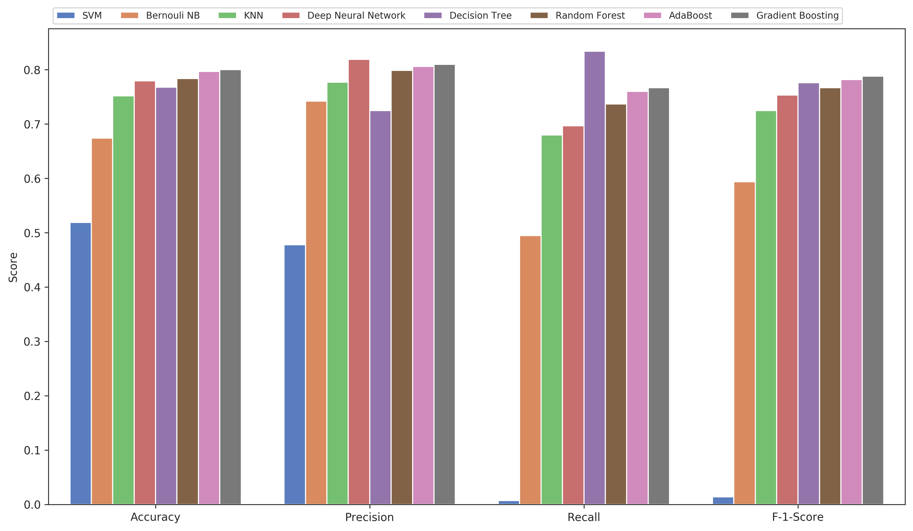
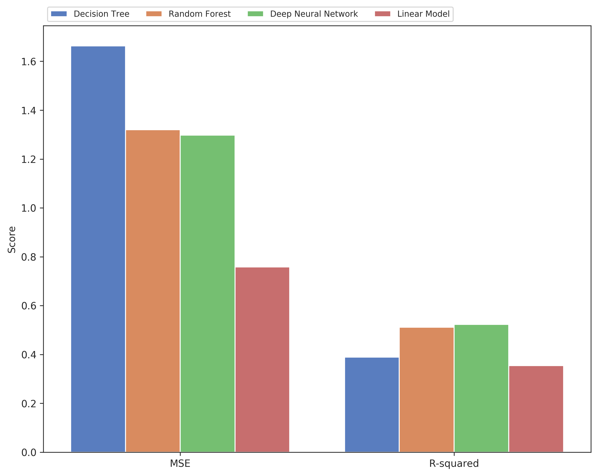
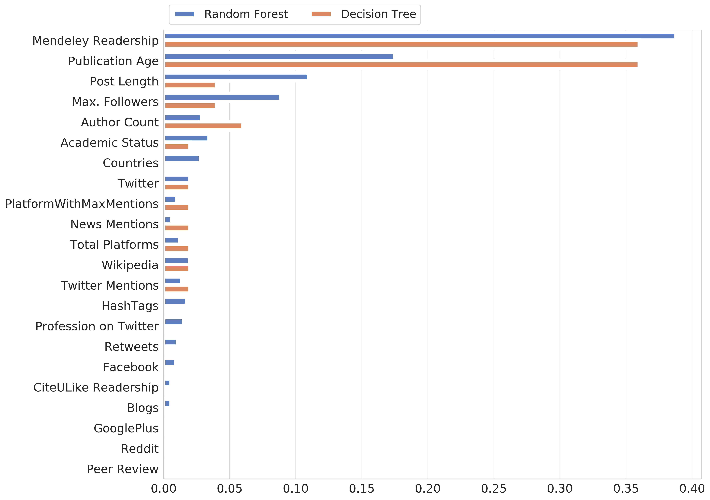

# Plots outlining the model effectiveness  while predicting scholarly impact

##### 1. Accuracy, Precision, Recall and F-1 scores for all 8 classifiers used in experiment-1

 

##### 2. Feature Importances for Decision Tree and Random Forest models used in experiment 1

 

##### 3. Accuracy, Precision, Recall and F-1 scores for all 8 classifiers used in experiment-2

 

##### 4. Feature Importances for Decision Tree and AdaBoost models used in experiment 2

 

##### 5. Mean Squared Error and R-squraed values for all 4 regressors used in experiment-3

 

##### 6. Feature Importances for Random Forest and Decision Tree models used in experiment 3

 

