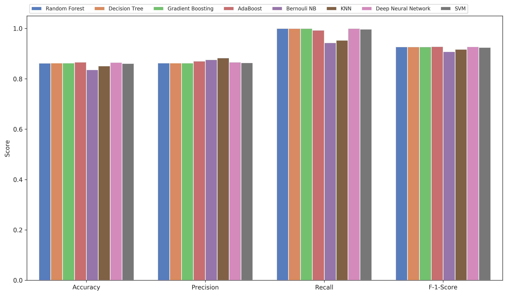
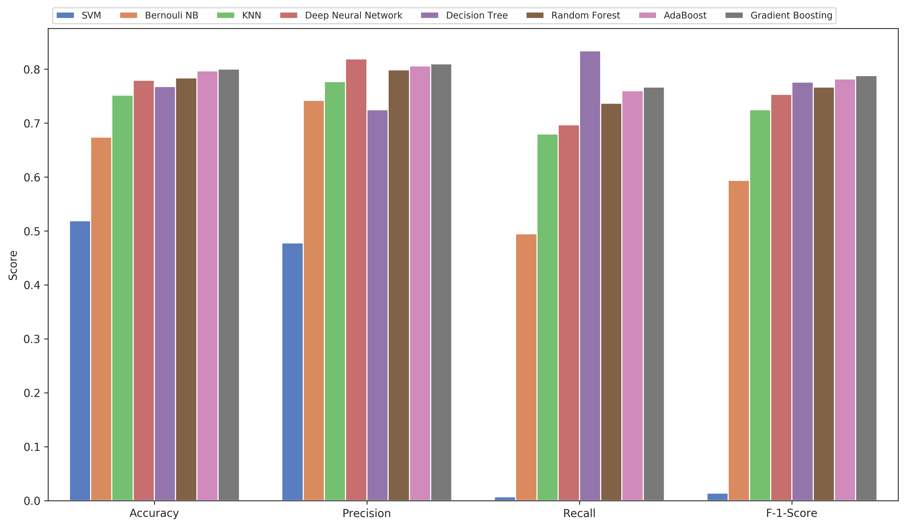
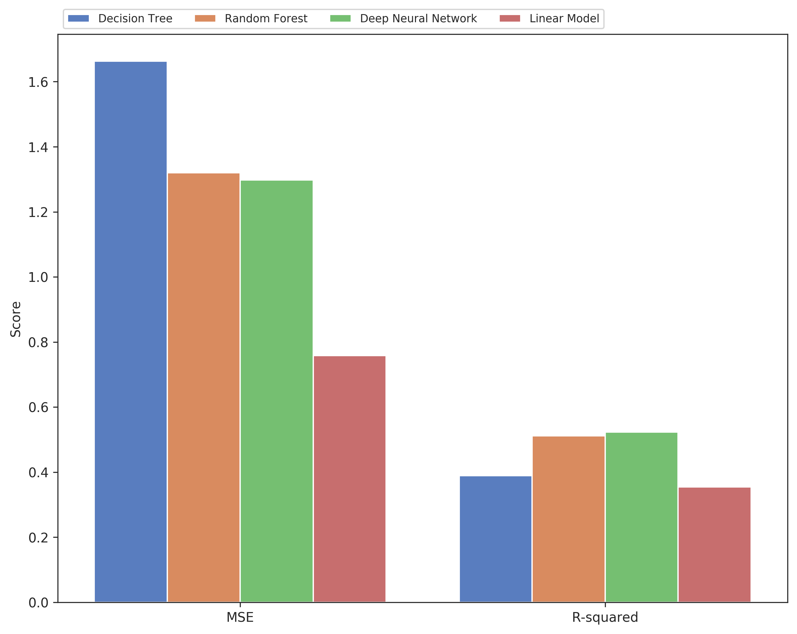
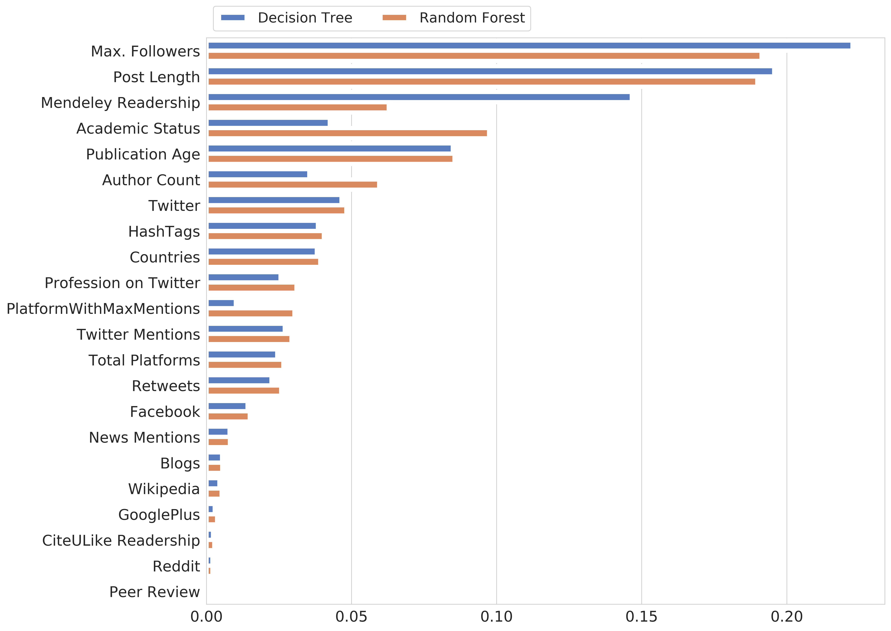
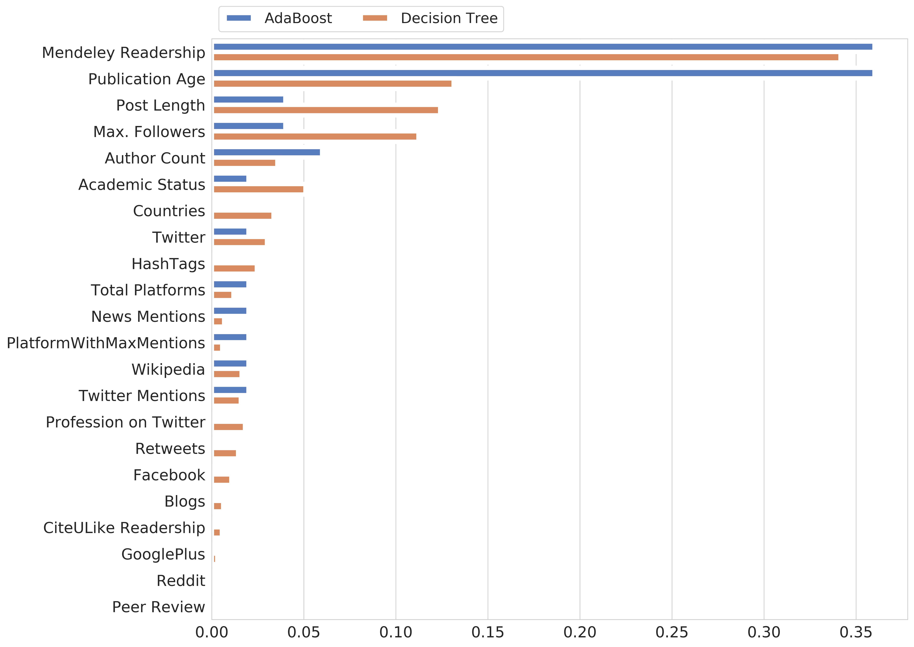
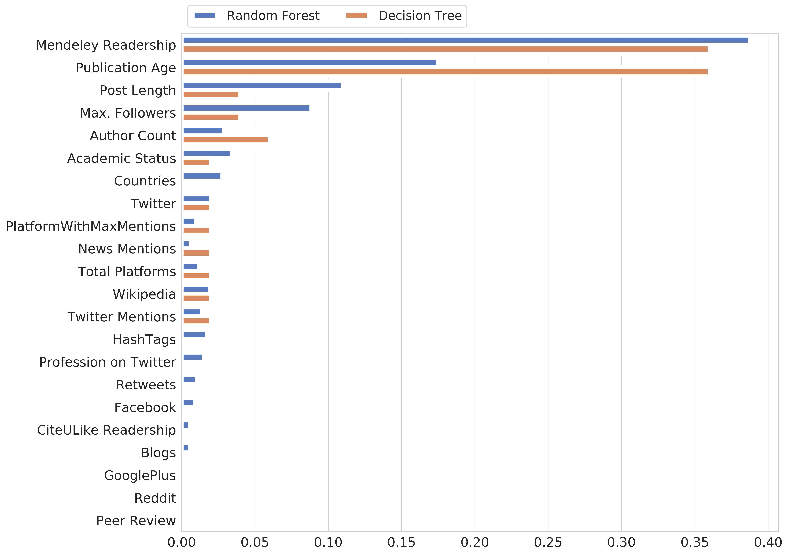
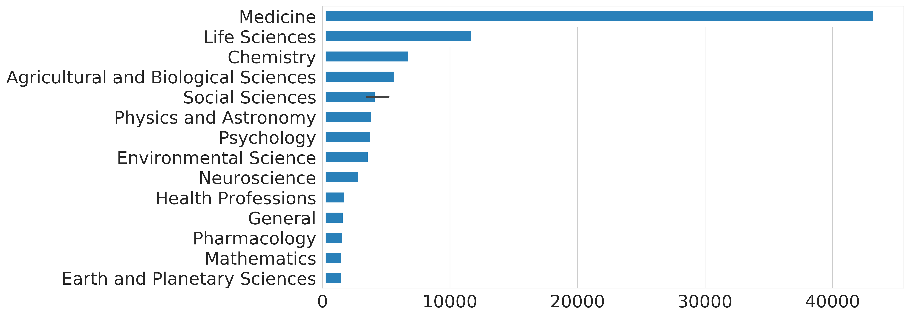
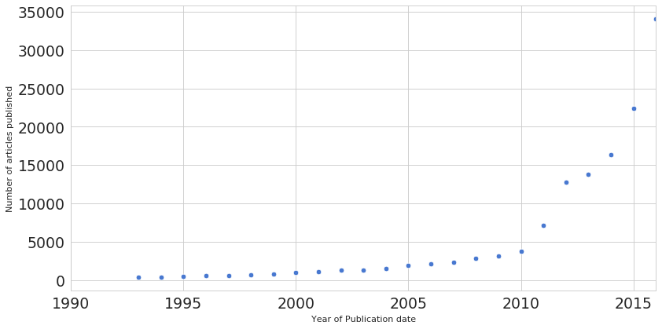

# Generating plots for outlining the model effectiveness  while predicting scholarly impact

### 1. Import the libraries


```python
# This Source Code Form is subject to the terms of the MIT
# License. If a copy of the same was not distributed with this
# file, You can obtain one at
# https://github.com/akhilpandey95/scholarlyimpact/blob/master/LICENSE.

import numpy as np
import pandas as pd
from tqdm import tqdm
import seaborn as sns
import matplotlib.pyplot as plt
from collections import defaultdict
from matplotlib.pyplot import figure
from sklearn.preprocessing import LabelEncoder
```

### 2. Collect the experiment results and visualize

#### 2.1 Experiment - 1 | Predicting the existance of citations using 8 classifiers

##### 2.1.1 Collect the results for experiment 1 and store them in a dictionary


```python
data = defaultdict(dict)

# accuracy
data['Random Forest']['Accuracy'] = 0.862
data['Decision Tree']['Accuracy'] = 0.863
data['Gradient Boosting']['Accuracy'] = 0.863
data['AdaBoost']['Accuracy'] = 0.866
data['Bernouli NB']['Accuracy'] = 0.836
data['KNN']['Accuracy'] = 0.851
data['Deep Neural Network']['Accuracy'] = 0.865
data['SVM']['Accuracy'] = 0.861

# precision
data['Random Forest']['Precision'] = 0.863
data['Decision Tree']['Precision'] = 0.863
data['Gradient Boosting']['Precision'] = 0.863
data['AdaBoost']['Precision'] = 0.870
data['Bernouli NB']['Precision'] = 0.876
data['KNN']['Precision'] = 0.883
data['Deep Neural Network']['Precision'] = 0.866
data['SVM']['Precision'] = 0.864

# recall
data['Random Forest']['Recall'] = 1.0
data['Decision Tree']['Recall'] = 1.0
data['Gradient Boosting']['Recall'] = 1.0
data['AdaBoost']['Recall'] = 0.993
data['Bernouli NB']['Recall'] = 0.943
data['KNN']['Recall'] = 0.953
data['Deep Neural Network']['Recall'] = 1.0
data['SVM']['Recall'] = 0.997

# f-1
data['Random Forest']['F-1-Score'] = 0.927
data['Decision Tree']['F-1-Score'] = 0.927
data['Gradient Boosting']['F-1-Score'] = 0.927
data['AdaBoost']['F-1-Score'] = 0.928
data['Bernouli NB']['F-1-Score'] = 0.908
data['KNN']['F-1-Score'] = 0.917
data['Deep Neural Network']['F-1-Score'] = 0.9279
data['SVM']['F-1-Score'] = 0.925
```

##### 2.1.2 Store the results of experiment 1 into a dataframe


```python
# init a dataframe
exp_1 = pd.DataFrame()

# group all of the results into three columns
exp_1 = exp_1.assign(model = [y for y in data.keys() for x in data[y].keys()])
exp_1 = exp_1.assign(metric = [x for y in data.keys() for x in data[y].keys()])
exp_1 = exp_1.assign(value = [data[y][x] for y in data.keys() for x in data[y].keys()])

# print the head
exp_1.head()
```


<div>
<style scoped>
    .dataframe tbody tr th:only-of-type {
        vertical-align: middle;
    }

    .dataframe tbody tr th {
        vertical-align: top;
    }

    .dataframe thead th {
        text-align: right;
    }
</style>
<table border="1" class="dataframe">
  <thead>
    <tr style="text-align: right;">
      <th></th>
      <th>model</th>
      <th>metric</th>
      <th>value</th>
    </tr>
  </thead>
  <tbody>
    <tr>
      <th>0</th>
      <td>Random Forest</td>
      <td>Accuracy</td>
      <td>0.862</td>
    </tr>
    <tr>
      <th>1</th>
      <td>Random Forest</td>
      <td>Precision</td>
      <td>0.863</td>
    </tr>
    <tr>
      <th>2</th>
      <td>Random Forest</td>
      <td>Recall</td>
      <td>1.000</td>
    </tr>
    <tr>
      <th>3</th>
      <td>Random Forest</td>
      <td>F-1-Score</td>
      <td>0.927</td>
    </tr>
    <tr>
      <th>4</th>
      <td>Decision Tree</td>
      <td>Accuracy</td>
      <td>0.863</td>
    </tr>
  </tbody>
</table>
</div>


##### 2.1.3 Visaulize stacked barchart with accuracy, precision, recall and f-1 scores for all 8 classifiers


```python
figure(num=None, figsize=(14,8), dpi=300, facecolor='w', edgecolor='k')
sns.set_style("ticks")
sns.set_palette("muted")
sns.plotting_context("talk", rc={"lines.linewidth": 2})

ax = sns.barplot(x="metric", y="value", hue="model", data=exp_1,
            order=["Accuracy", "Precision", "Recall", "F-1-Score"])

plt.ylabel("Score")
plt.xlabel("")

plt.legend(ncol=len(data), bbox_to_anchor=(0, 1),
              loc='lower left', fontsize='small')
plt.show()
```





#### 2.2 Experiment - 2 | Predicting if existing scholarly articles receieved more than the median number of citations or not using 8 classifiers

##### 2.2.1 Collect the results for experiment 2 and store them in a dictionary


```python
data = defaultdict(dict)

# accuracy
data['Random Forest']['Accuracy'] = 0.784
data['Decision Tree']['Accuracy'] = 0.768
data['Gradient Boosting']['Accuracy'] = 0.80
data['AdaBoost']['Accuracy'] = 0.797
data['Bernouli NB']['Accuracy'] = 0.674
data['KNN']['Accuracy'] = 0.752
data['Deep Neural Network']['Accuracy'] = 0.7794
data['SVM']['Accuracy'] = 0.519

# precision
data['Random Forest']['Precision'] = 0.799
data['Decision Tree']['Precision'] = 0.725
data['Gradient Boosting']['Precision'] = 0.810
data['AdaBoost']['Precision'] = 0.806
data['Bernouli NB']['Precision'] = 0.742
data['KNN']['Precision'] = 0.777
data['Deep Neural Network']['Precision'] = 0.81918
data['SVM']['Precision'] = 0.478

# recall
data['Random Forest']['Recall'] = 0.737
data['Decision Tree']['Recall'] = 0.834
data['Gradient Boosting']['Recall'] = 0.767
data['AdaBoost']['Recall'] = 0.760
data['Bernouli NB']['Recall'] = 0.495
data['KNN']['Recall'] = 0.680
data['Deep Neural Network']['Recall'] = 0.69692
data['SVM']['Recall'] = 0.007

# f-1
data['Random Forest']['F-1-Score'] = 0.767
data['Decision Tree']['F-1-Score'] = 0.776
data['Gradient Boosting']['F-1-Score'] = 0.788
data['AdaBoost']['F-1-Score'] = 0.782
data['Bernouli NB']['F-1-Score'] = 0.594
data['KNN']['F-1-Score'] = 0.725
data['Deep Neural Network']['F-1-Score'] = 0.75312
data['SVM']['F-1-Score'] = 0.014
```

##### 2.2.2 Store the results of experiment 2 into a dataframe


```python
# create a dataframe for storing the results
exp_2 = pd.DataFrame()

# group all of the results into three columns
exp_2 = exp_2.assign(model = [y for y in data.keys() for x in data[y].keys()])
exp_2 = exp_2.assign(metric = [x for y in data.keys() for x in data[y].keys()])
exp_2 = exp_2.assign(value = [data[y][x] for y in data.keys() for x in data[y].keys()])

# sort the values in ascending order
exp_2.sort_values(by='value',ascending=True, inplace=True)

# print the head
exp_2.head()
```


<div>
<style scoped>
    .dataframe tbody tr th:only-of-type {
        vertical-align: middle;
    }

    .dataframe tbody tr th {
        vertical-align: top;
    }

    .dataframe thead th {
        text-align: right;
    }
</style>
<table border="1" class="dataframe">
  <thead>
    <tr style="text-align: right;">
      <th></th>
      <th>model</th>
      <th>metric</th>
      <th>value</th>
    </tr>
  </thead>
  <tbody>
    <tr>
      <th>30</th>
      <td>SVM</td>
      <td>Recall</td>
      <td>0.007</td>
    </tr>
    <tr>
      <th>31</th>
      <td>SVM</td>
      <td>F-1-Score</td>
      <td>0.014</td>
    </tr>
    <tr>
      <th>29</th>
      <td>SVM</td>
      <td>Precision</td>
      <td>0.478</td>
    </tr>
    <tr>
      <th>18</th>
      <td>Bernouli NB</td>
      <td>Recall</td>
      <td>0.495</td>
    </tr>
    <tr>
      <th>28</th>
      <td>SVM</td>
      <td>Accuracy</td>
      <td>0.519</td>
    </tr>
  </tbody>
</table>
</div>


##### 2.2.3 Visaulize stacked barchart with accuracy, precision, recall and f-1 scores for all 8 classifiers


```python
figure(num=None, figsize=(14,8), dpi=300, facecolor='w', edgecolor='k')
sns.set_style("ticks")
sns.set_palette("muted")
sns.plotting_context("talk", rc={"lines.linewidth": 2})

ax = sns.barplot(x="metric", y="value", hue="model", data=exp_2,
            order=["Accuracy", "Precision", "Recall", "F-1-Score"])

plt.ylabel("Score")
plt.xlabel("")

plt.legend(ncol=len(data), bbox_to_anchor=(0, 1),
              loc='lower left', fontsize='small')
plt.show()
```





#### 2.3 Experiment - 3 | Predicting log transformation of citations for the scholarly articles using 4 regressors

##### 2.3.1 Collect the results for experiment 3 and store them in a dictionary


```python
data = defaultdict(dict)

# mse
data['Random Forest']['MSE'] = 1.32
data['Decision Tree']['MSE'] = 1.663
data['Deep Neural Network']['MSE'] = 1.29756
data['Linear Model']['MSE'] = 0.758

# r-squared
data['Random Forest']['R-squared'] = 0.512
data['Decision Tree']['R-squared'] = 0.389
data['Deep Neural Network']['R-squared'] = 0.52284
data['Linear Model']['R-squared'] = 0.354
```

##### 2.3.2 Store the results of experiment 3 into a dataframe


```python
# create a dataframe for storing the results
exp_3 = pd.DataFrame()

# group all of the results into three columns
exp_3 = exp_3.assign(model = [y for y in data.keys() for x in data[y].keys()])
exp_3 = exp_3.assign(metric = [x for y in data.keys() for x in data[y].keys()])
exp_3 = exp_3.assign(value = [data[y][x] for y in data.keys() for x in data[y].keys()])

# sort the values in ascending order
exp_3.sort_values(by='value',ascending=False, inplace=True)

# print the head
exp_3.head()
```


<div>
<style scoped>
    .dataframe tbody tr th:only-of-type {
        vertical-align: middle;
    }

    .dataframe tbody tr th {
        vertical-align: top;
    }

    .dataframe thead th {
        text-align: right;
    }
</style>
<table border="1" class="dataframe">
  <thead>
    <tr style="text-align: right;">
      <th></th>
      <th>model</th>
      <th>metric</th>
      <th>value</th>
    </tr>
  </thead>
  <tbody>
    <tr>
      <th>2</th>
      <td>Decision Tree</td>
      <td>MSE</td>
      <td>1.66300</td>
    </tr>
    <tr>
      <th>0</th>
      <td>Random Forest</td>
      <td>MSE</td>
      <td>1.32000</td>
    </tr>
    <tr>
      <th>4</th>
      <td>Deep Neural Network</td>
      <td>MSE</td>
      <td>1.29756</td>
    </tr>
    <tr>
      <th>6</th>
      <td>Linear Model</td>
      <td>MSE</td>
      <td>0.75800</td>
    </tr>
    <tr>
      <th>5</th>
      <td>Deep Neural Network</td>
      <td>R-squared</td>
      <td>0.52284</td>
    </tr>
  </tbody>
</table>
</div>


##### 2.3.3 Visaulize stacked barchart with MSE, r-squraed values for all 4 regressors


```python
figure(num=None, figsize=(10,8), dpi=300, facecolor='w', edgecolor='k')
sns.set_style("ticks")
sns.set_palette("muted")
sns.plotting_context("talk", rc={"lines.linewidth": 2})

ax = sns.barplot(x="metric", y="value", hue="model", data=exp_3,
            order=["MSE", "R-squared"])

plt.ylabel("Score")
plt.xlabel("")

plt.legend(ncol=len(data), bbox_to_anchor=(0, 1),
              loc='lower left', fontsize='small')
plt.show()
```





### 3. Collect feature importances for models and visualize

#### 3.1 Experiment - 1 | Predicting the existance of citations using 8 classifiers

##### 3.1.1 Collect the feature importances for DT, RF models used in experiment 1


```python
exp1_feat_imp = pd.DataFrame()

features = ['Mendeley Readership', 'CiteULike Readership', 'News Mentions', 'Blogs',
            'Reddit', 'Twitter', 'Facebook',
            'GooglePlus', 'Peer Review','Wikipedia',
            'Total Platforms', 'Publication Age','PlatformWithMaxMentions',
            'Countries', 'Max. Followers', 'Retweets','Profession on Twitter',
            'Academic Status', 'Post Length', 'HashTags', 'Twitter Mentions',
            'Author Count']

dt_exp1_feat_imp = [0.14661173, 0.0022706 , 0.008012  , 0.00542195, 0.00205643,
       0.04653446, 0.01420488, 0.00289522, 0.00032659, 0.00446718,
       0.02442009, 0.08492836, 0.01014047, 0.03804589, 0.22263922,
       0.02241952, 0.02554175, 0.04252594, 0.19565704, 0.03843932,
       0.02699838, 0.03544297]

rf_exp1_feat_imp = [0.0628296 , 0.00274167, 0.00812758, 0.00544699, 0.00207957,
       0.04822901, 0.01496749, 0.00366909, 0.0003672 , 0.00523471,
       0.02654277, 0.08548786, 0.03034041, 0.03922589, 0.19129849,
       0.02577536, 0.03102932, 0.09743179, 0.18983913, 0.04044973,
       0.02932414, 0.05956219]

exp1_feat_imp = exp1_feat_imp.assign(Features = features*2)
exp1_feat_imp = exp1_feat_imp.assign(Values = dt_exp1_feat_imp +  rf_exp1_feat_imp)
exp1_feat_imp = exp1_feat_imp.assign(Model =
                                     ['Decision Tree']*len(features)
                                     + ['Random Forest']*len(features))

exp1_feat_imp.sort_values(by='Values',ascending=False, inplace=True)
```

##### 3.1.2 Visualize the feature importances for DT, RF models used in experiment 1


```python
figure(num=None, figsize=(14,12), dpi=400, facecolor='w', edgecolor='k')
sns.set_style("whitegrid")
sns.set_palette("muted")
sns.plotting_context("talk", rc={"lines.linewidth": 14})

ax = sns.barplot(x="Values", y="Features", hue="Model", data=exp1_feat_imp)

plt.ylabel("")
plt.xlabel("")
ax.tick_params(labelsize=17)
plt.setp(ax.patches, linewidth=5)
plt.legend(ncol=len(exp1_feat_imp), bbox_to_anchor=(0, 1),
              loc='lower left', prop={'size': 16})
plt.show()
```





#### 3.2 Experiment - 2 | Predicting if existing scholarly articles receieved more than the median number of citations or not using 8 classifiers

##### 3.2.1 Collect the feature importances for DT, ADB models used in experiment 2


```python
exp2_feat_imp = pd.DataFrame()

dt_exp2_feat_imp = [0.34151413, 0.0055195 , 0.0067308 , 0.00621686, 0.00139434,
       0.02998536, 0.01066248, 0.00299369, 0.00063268, 0.01621288,
       0.0118241 , 0.13138291, 0.0056598 , 0.03356661, 0.11233215,
       0.01432445, 0.01806279, 0.05093801, 0.12406463, 0.02451521,
       0.01580069, 0.03566594]

adb_exp2_feat_imp = [0.36, 0., 0.02, 0., 0., 0.02, 0., 0., 0., 0.02, 0.02,
       0.36, 0.02, 0., 0.04, 0., 0., 0.02, 0.04, 0., 0.02, 0.06]

exp2_feat_imp = exp2_feat_imp.assign(Features = features*2)
exp2_feat_imp = exp2_feat_imp.assign(Values = dt_exp2_feat_imp +  adb_exp2_feat_imp)
exp2_feat_imp = exp2_feat_imp.assign(Model =
                                     ['Decision Tree']*len(features)
                                     + ['AdaBoost']*len(features))

exp2_feat_imp.sort_values(by='Values',ascending=False, inplace=True)
```

##### 3.2.2 Visualize the feature importances for DT, ADB models used in experiment 2


```python
figure(num=None, figsize=(14,12), dpi=400, facecolor='w', edgecolor='k')
sns.set_style("whitegrid")
sns.set_palette("muted")
sns.plotting_context("talk", rc={"lines.linewidth": 14})

ax = sns.barplot(x="Values", y="Features", hue="Model", data=exp2_feat_imp)

plt.ylabel("")
plt.xlabel("")
ax.tick_params(labelsize=17)
plt.setp(ax.patches, linewidth=5)
plt.legend(ncol=len(exp1_feat_imp), bbox_to_anchor=(0, 1),
              loc='lower left', prop={'size': 16})
plt.show()
```





#### 3.3 Experiment - 3 | Predicting log transformation of citations for the scholarly articles using 4 regressors

##### 3.3.1 Collect the feature importances for RF, DT models used in experiment 3


```python
exp3_feat_imp = pd.DataFrame()

rf_exp3_feat_imp = [0.38764522, 0.00570947, 0.00602786, 0.00566104, 0.00103469,
       0.02002881, 0.00936555, 0.00242282, 0.00042339, 0.01955029,
       0.01201025, 0.17468673, 0.00984561, 0.02783804, 0.08850875,
       0.01039228, 0.01491627, 0.03439303, 0.10964378, 0.01748978,
       0.01377577, 0.02863057]

dt_exp3_feat_imp = [0.36, 0., 0.02, 0., 0., 0.02, 0., 0., 0., 0.02, 0.02,
       0.36, 0.02, 0., 0.04, 0., 0., 0.02, 0.04, 0., 0.02, 0.06]

exp3_feat_imp = exp3_feat_imp.assign(Features = features*2)
exp3_feat_imp = exp3_feat_imp.assign(Values = rf_exp3_feat_imp +  dt_exp3_feat_imp)
exp3_feat_imp = exp3_feat_imp.assign(Model =
                                     ['Random Forest']*len(features)
                                     + ['Decision Tree']*len(features))

exp3_feat_imp.sort_values(by='Values',ascending=False, inplace=True)
```

##### 3.3.2 Visualize the feature importances for RF, DT models used in experiment 3


```python
figure(num=None, figsize=(14,12), dpi=400, facecolor='w', edgecolor='k')
sns.set_style("whitegrid")
sns.set_palette("muted")
sns.plotting_context("talk", rc={"lines.linewidth": 14})

ax = sns.barplot(x="Values", y="Features", hue="Model", data=exp3_feat_imp)

plt.ylabel("")
plt.xlabel("")
ax.tick_params(labelsize=17)
plt.setp(ax.patches, linewidth=5)
plt.legend(ncol=len(exp1_feat_imp), bbox_to_anchor=(0, 1),
              loc='lower left', prop={'size': 16})
plt.show()
```





### 4. Collect descriptive statistics for features used in the experiments

#### 4.1 Load the dataset and pre-process the features


```python
# read the dataset
data = pd.read_csv('/home/hector/Downloads/sch_impact.csv')

# create the label encoder
encoder = LabelEncoder()

# transform all the columns
data.Type = encoder.fit_transform(data.Type)

# transform the column profession
data.Profession = encoder.fit_transform(data.Profession)

# transform the column academic status
data.AcademicStatus = encoder.fit_transform(data.AcademicStatus)

# transform the column platform with max mentions
data.PlatformWithMaxMentions = encoder.fit_transform(data.PlatformWithMaxMentions)

# create a target variable for the first experiment
data = data.assign(target_exp_1 =
                   list(map(lambda x: 1 if x > 0 else 0, tqdm(data['citations']))))

# create a target variable for the second experiment
data = data.assign(target_exp_2 =
                   list(map(lambda x: 1 if x > 9 else 0, tqdm(data['citations']))))

# create a target variable for the third experiment
data = data.assign(target_exp_3 =
                   list(map(lambda x: np.log(1 + x), tqdm(data['citations']))))

# drop the columns unecessary
data = data.drop(columns=['Type', 'citations', 'citations(Log_Transformed)'])

# store the features used for the experiments
feat_desc_stats = data[['mendeley', 'citeulike', 'News', 'Blogs', 'TotalPosts', 'Reddit',
       'Twitter', 'Facebook', 'GooglePlus', 'PeerReviews', 'Wikipedia',
       'paperid', 'TotalPlatforms', 'SincePublication',
       'PlatformWithMaxMentions', 'Countries', 'MaxFollowers', 'Retweets',
       'Profession', 'AcademicStatus', 'PostLength', 'HashTags', 'Mentions',
       'AuthorCount', 'TimeLapse']].describe()

# round the descriptive stats for all features to 2 decimal points
for feature in feat_desc_stats.keys():
    for key in feat_desc_stats[feature].keys():
        feat_desc_stats[feature][key] = np.around(feat_desc_stats[feature][key], 2)

# drop the count statistic for all feature
feat_desc_stats = feat_desc_stats.drop('count', axis=0)

# print the update descriptive stats
feat_desc_stats
```

    100%|██████████| 130745/130745 [00:00<00:00, 2029271.63it/s]
    100%|██████████| 130745/130745 [00:00<00:00, 2110566.52it/s]
    100%|██████████| 130745/130745 [00:00<00:00, 592619.79it/s]


<div>
<style scoped>
    .dataframe tbody tr th:only-of-type {
        vertical-align: middle;
    }

    .dataframe tbody tr th {
        vertical-align: top;
    }

    .dataframe thead th {
        text-align: right;
    }
</style>
<table border="1" class="dataframe">
  <thead>
    <tr style="text-align: right;">
      <th></th>
      <th>mendeley</th>
      <th>citeulike</th>
      <th>News</th>
      <th>Blogs</th>
      <th>TotalPosts</th>
      <th>Reddit</th>
      <th>Twitter</th>
      <th>Facebook</th>
      <th>GooglePlus</th>
      <th>PeerReviews</th>
      <th>...</th>
      <th>Countries</th>
      <th>MaxFollowers</th>
      <th>Retweets</th>
      <th>Profession</th>
      <th>AcademicStatus</th>
      <th>PostLength</th>
      <th>HashTags</th>
      <th>Mentions</th>
      <th>AuthorCount</th>
      <th>TimeLapse</th>
    </tr>
  </thead>
  <tbody>
    <tr>
      <th>mean</th>
      <td>15.67</td>
      <td>0.14</td>
      <td>0.28</td>
      <td>0.14</td>
      <td>5.75</td>
      <td>0.02</td>
      <td>4.62</td>
      <td>0.41</td>
      <td>0.07</td>
      <td>0.01</td>
      <td>...</td>
      <td>2.51</td>
      <td>8634.65</td>
      <td>2.19</td>
      <td>2.41</td>
      <td>17.30</td>
      <td>123.49</td>
      <td>0.94</td>
      <td>0.83</td>
      <td>2.07</td>
      <td>1.0</td>
    </tr>
    <tr>
      <th>std</th>
      <td>47.88</td>
      <td>0.88</td>
      <td>2.79</td>
      <td>0.73</td>
      <td>31.53</td>
      <td>0.20</td>
      <td>27.83</td>
      <td>4.39</td>
      <td>0.90</td>
      <td>0.26</td>
      <td>...</td>
      <td>3.67</td>
      <td>67790.49</td>
      <td>18.96</td>
      <td>0.91</td>
      <td>6.79</td>
      <td>70.17</td>
      <td>2.99</td>
      <td>4.09</td>
      <td>23.00</td>
      <td>0.0</td>
    </tr>
    <tr>
      <th>min</th>
      <td>0.00</td>
      <td>0.00</td>
      <td>0.00</td>
      <td>0.00</td>
      <td>0.00</td>
      <td>0.00</td>
      <td>0.00</td>
      <td>0.00</td>
      <td>0.00</td>
      <td>0.00</td>
      <td>...</td>
      <td>0.00</td>
      <td>0.00</td>
      <td>0.00</td>
      <td>0.00</td>
      <td>0.00</td>
      <td>0.00</td>
      <td>0.00</td>
      <td>0.00</td>
      <td>0.00</td>
      <td>1.0</td>
    </tr>
    <tr>
      <th>25%</th>
      <td>0.00</td>
      <td>0.00</td>
      <td>0.00</td>
      <td>0.00</td>
      <td>1.00</td>
      <td>0.00</td>
      <td>1.00</td>
      <td>0.00</td>
      <td>0.00</td>
      <td>0.00</td>
      <td>...</td>
      <td>1.00</td>
      <td>4.00</td>
      <td>0.00</td>
      <td>2.00</td>
      <td>11.00</td>
      <td>70.00</td>
      <td>0.00</td>
      <td>0.00</td>
      <td>0.00</td>
      <td>1.0</td>
    </tr>
    <tr>
      <th>50%</th>
      <td>4.00</td>
      <td>0.00</td>
      <td>0.00</td>
      <td>0.00</td>
      <td>2.00</td>
      <td>0.00</td>
      <td>1.00</td>
      <td>0.00</td>
      <td>0.00</td>
      <td>0.00</td>
      <td>...</td>
      <td>1.00</td>
      <td>525.00</td>
      <td>0.00</td>
      <td>3.00</td>
      <td>19.00</td>
      <td>130.00</td>
      <td>0.00</td>
      <td>0.00</td>
      <td>0.00</td>
      <td>1.0</td>
    </tr>
    <tr>
      <th>75%</th>
      <td>15.00</td>
      <td>0.00</td>
      <td>0.00</td>
      <td>0.00</td>
      <td>4.00</td>
      <td>0.00</td>
      <td>3.00</td>
      <td>0.00</td>
      <td>0.00</td>
      <td>0.00</td>
      <td>...</td>
      <td>3.00</td>
      <td>2603.00</td>
      <td>1.00</td>
      <td>3.00</td>
      <td>24.00</td>
      <td>145.00</td>
      <td>1.00</td>
      <td>1.00</td>
      <td>2.00</td>
      <td>1.0</td>
    </tr>
    <tr>
      <th>max</th>
      <td>9031.00</td>
      <td>105.00</td>
      <td>314.00</td>
      <td>62.00</td>
      <td>3543.00</td>
      <td>24.00</td>
      <td>3339.00</td>
      <td>893.00</td>
      <td>101.00</td>
      <td>45.00</td>
      <td>...</td>
      <td>107.00</td>
      <td>7168244.00</td>
      <td>2314.00</td>
      <td>3.00</td>
      <td>24.00</td>
      <td>313.00</td>
      <td>278.00</td>
      <td>391.00</td>
      <td>5737.00</td>
      <td>1.0</td>
    </tr>
  </tbody>
</table>
<p>7 rows × 25 columns</p>
</div>


#### 4.2 Write the values of the descriptive statistics to a CSV file


```python
test.to_csv('sch_imp_feature_descriptive_stats.csv', encoding='utf-8')
```

### 5. Generate the correlation matrix for the features


```python
# control the aesthetics of the figure
figure(num=None, figsize=(14,12), dpi=300, facecolor='w', edgecolor='k')
sns.set_style("whitegrid")
sns.set_palette("muted")
sns.plotting_context("talk", rc={"lines.linewidth": 14})

# consider only the features used and store them into data
data = data[['mendeley', 'citeulike', 'News', 'Blogs', 'Reddit',
       'Twitter', 'Facebook', 'GooglePlus', 'PeerReviews', 'Wikipedia',
        'TotalPlatforms', 'SincePublication','PlatformWithMaxMentions',
        'Countries', 'MaxFollowers', 'Retweets', 'Profession',
        'AcademicStatus', 'PostLength', 'HashTags', 'Mentions','AuthorCount']]

# rename certain columns
data = data.rename(columns={"AuthorCount": "Author Count", "Mentions": "Twitter Mentions",
                           "mendeley": "Mendeley Readership",
                            "citeulike": "CiteULike Readership", "News": "News Mentions",
                           "PeerReviews": "Peer Review", "TotalPlatforms": "Total Platforms",
                           "MaxFollowers": "Max. Followers", "PostLength": "Post Length",
                           "PlatformWithMaxMentions": "Platform With Max. Mentions",
                           "AcademicStatus": "Academic Status",
                            "Profession": "Profession on Twitter",
                           "SincePublication": "Publication Age"})

# generate the heatmap for the correlation matrix
ax = sns.heatmap(data.corr())

# adjust the label size and line width
ax.tick_params(labelsize=17)
plt.setp(ax.patches, linewidth=5)

# show the plot
plt.show()
```


### 6. Visualize the topic distribution of scholarly articles

#### 6.1 Load the topic distribution data and pre-process


```python
# read the topic distribution dataset
topics = pd.read_csv('/home/hector/Downloads/topic_dist_db2.csv')

# drop unecessary columns
topics = topics.drop(columns=['Unnamed: 0'])

# sort the topics in descending order
topics.sort_values(by='count',ascending=False, inplace=True)

# print the head
topics.head()
```


<div>
<style scoped>
    .dataframe tbody tr th:only-of-type {
        vertical-align: middle;
    }

    .dataframe tbody tr th {
        vertical-align: top;
    }

    .dataframe thead th {
        text-align: right;
    }
</style>
<table border="1" class="dataframe">
  <thead>
    <tr style="text-align: right;">
      <th></th>
      <th>name</th>
      <th>count</th>
    </tr>
  </thead>
  <tbody>
    <tr>
      <th>1</th>
      <td>Medicine</td>
      <td>43418</td>
    </tr>
    <tr>
      <th>4</th>
      <td>Life Sciences</td>
      <td>11878</td>
    </tr>
    <tr>
      <th>7</th>
      <td>Chemistry</td>
      <td>6922</td>
    </tr>
    <tr>
      <th>2</th>
      <td>Agricultural and Biological Sciences</td>
      <td>5816</td>
    </tr>
    <tr>
      <th>9</th>
      <td>Social Sciences</td>
      <td>5158</td>
    </tr>
  </tbody>
</table>
</div>


#### 6.2 Visualize the topic distribution using a horizontal barplot


```python
# control the aesthetics
figure(num=None, figsize=(12,6), dpi=400, facecolor='w', edgecolor='k')
sns.set_style("whitegrid")
sns.color_palette("muted")
sns.plotting_context("talk", rc={"lines.linewidth": 14})

# generate the horizontal barplot for top 15 topics
ax = sns.barplot(x="count", y="name", data=topics.head(15),  facecolor='#2980b9')

# eliminate the labels on x and y axis
plt.ylabel("")
plt.xlabel("")

# adjust the label size and line width
ax.tick_params(labelsize=20)
plt.setp(ax.patches, linewidth=7)

# display the plot
plt.show()
```





### 7. Visualize the frequency of articles published every year

#### 7.1 Load the frequency distribution of scholarly articles and pre-process


```python
# load the dataset
date_range = pd.read_csv('/home/hector/Downloads/date_range_db2.csv')

# drop uncessary columns
date_range = date_range.drop(columns=['Unnamed: 0'])

# sort the counts by year
date_range.sort_values(by='date',ascending=False, inplace=True)

# consider only the articles from 1992 to 2017
date_range = date_range.loc[(date_range.date > 1992) & (date_range.date < 2017)]

# print the head
date_range.head()
```


<div>
<style scoped>
    .dataframe tbody tr th:only-of-type {
        vertical-align: middle;
    }

    .dataframe tbody tr th {
        vertical-align: top;
    }

    .dataframe thead th {
        text-align: right;
    }
</style>
<table border="1" class="dataframe">
  <thead>
    <tr style="text-align: right;">
      <th></th>
      <th>date</th>
      <th>count</th>
    </tr>
  </thead>
  <tbody>
    <tr>
      <th>0</th>
      <td>2016</td>
      <td>34089</td>
    </tr>
    <tr>
      <th>2</th>
      <td>2015</td>
      <td>22428</td>
    </tr>
    <tr>
      <th>3</th>
      <td>2014</td>
      <td>16400</td>
    </tr>
    <tr>
      <th>4</th>
      <td>2013</td>
      <td>13848</td>
    </tr>
    <tr>
      <th>1</th>
      <td>2012</td>
      <td>12742</td>
    </tr>
  </tbody>
</table>
</div>


#### 7.2 Visualize the frequency distribution of scholarly articles by year using a horizontal barplot


```python
# control the aesthetics
figure(num=None, figsize=(12,6), dpi=80, facecolor='w', edgecolor='k')
sns.set_style("whitegrid")
sns.plotting_context("talk", rc={"lines.linewidth": 14})

# generate the scatterplot with blue pallete
ax = sns.scatterplot(x="date", y="count", data=date_range, palette="Blues_d")

# adjust the x-label and y-label
plt.ylabel("Number of articles published")
plt.xlabel("Year of Publication date")

# adjust the label size
ax.tick_params(labelsize=17)

# adjust the x limit
plt.xlim(1990, 2016)

# display the plot
plt.show()
```



